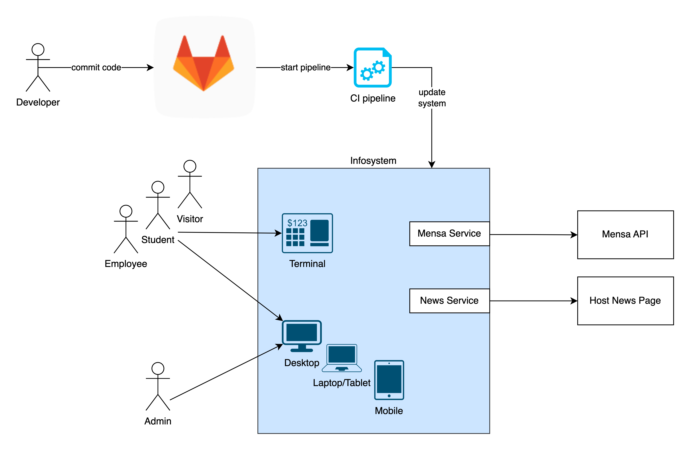
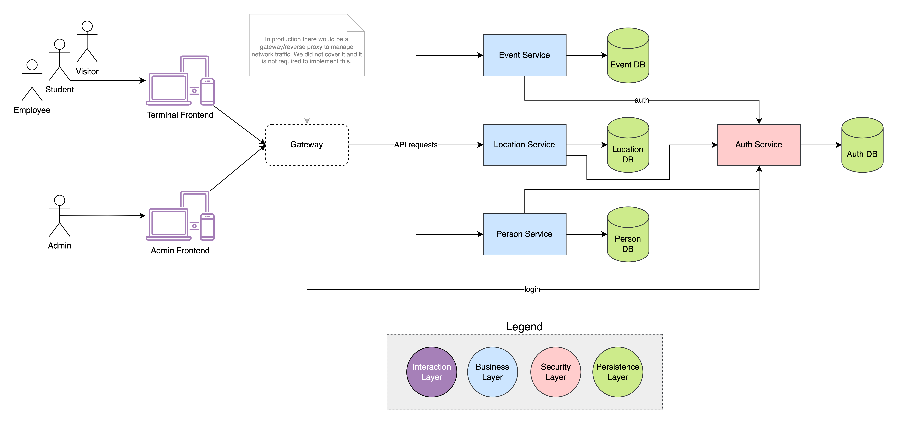

# Infosys

✨ **This workspace has been generated by [Nx, a Smart, fast and extensible build system.](https://nx.dev)** ✨

## Development server

Run `yarn start` to launch all the apps and the api. The apps will automatically reload if you change any of the source files.

## Apps

- [terminal](http://localhost:4200)
- [admin](http://localhost:4300)
- [auth](http://localhost:3334/api)
- [events](http://localhost:3333/api)

### Terminal

This is the main app. It is the one that the user will interact with and is used to display various information.

### Admin

This is the admin app. It is used to manage the events and the users.

### Auth

This is the authentication api. It is used to authenticate and manage the users.

### Events

This is the events api. It is used to manage the events.
